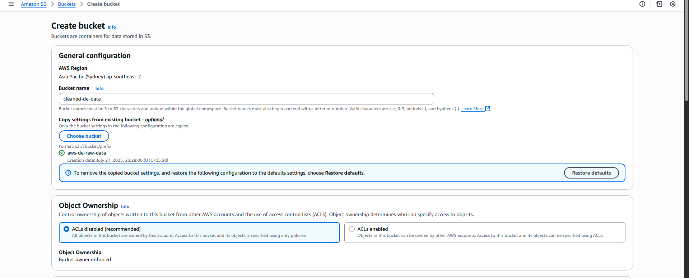
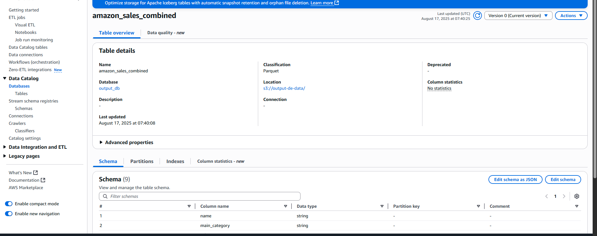
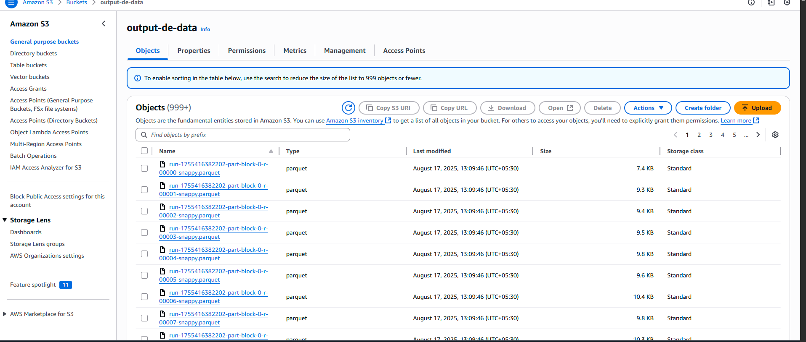

# Glue Notebook: End-to-End Pipeline Guide

## 1. Setup
- Created AWS Glue **notebook job** for data processing using PySpark.
- Configured input bucket for raw data and created a new output bucket: `output-de-data`.


---
## 2. Data Ingestion
- Loaded multiple raw tables into Spark DataFrames from the source database.
- Extracted headers and standardized schemas.
---
## 3. Column Standardization
- Renamed all input columns into a fixed schema for consistency:

- Used `withColumnRenamed` to enforce consistency across all tables.
---
## 4. Union Step
- Combined all standardized DataFrames into a single unified DataFrame.
- Title: **Combine Standardized Tables**
---
## 5. Output Strategy
- Decided to store processed output in **S3 (Parquet format)** instead of RDS or DynamoDB.
- Rationale:
- Parquet is columnar, compressed, and query-efficient.
- Required for Athena and integrates well with **Amazon QuickSight**.
---
## 6. Glue Catalog Integration
- Wrote output to S3 and registered in **Glue Data Catalog** for schema discovery.

- Chose table name: `amazon_sales_data`
- Chose Glue catalog object: `amazon_sales_combined`
---
## 7. File Output Behavior
- Observed Spark writing multiple parquet files due to parallelism.

- Learned:
- Many small files = normal in Spark but inefficient for Athena.
- Controll number of files using:
  ```python
  df.coalesce(1)       # single output file
  df.repartition(10)   # exactly 10 output files
  ```
---
## 8. Final Architecture
- **Input:** Raw data bucket (multiple tables).
- **Transform:** Glue Notebook (PySpark).
- **Output:** S3 bucket `output-de-data` with Parquet files.
- **Catalog:** Glue Data Catalog with table `amazon_sales_data`.
- **Visualization:** Amazon QuickSight connected to Glue/Athena.
---
## 9. Challenges Faced
- Schema mismatch across source tables → fixed with renaming step.
- Decision between RDS/DynamoDB/S3 → chose S3 + Glue for analytics.
---
## 10. Next Steps
- Optimize partitioning for Athena queries.
- Multiple small parquet files in s3 → solve with coalesce/repartition.
- Automate job scheduling in Glue Workflow.
- Connect QuickSight dashboards to the curated dataset.
