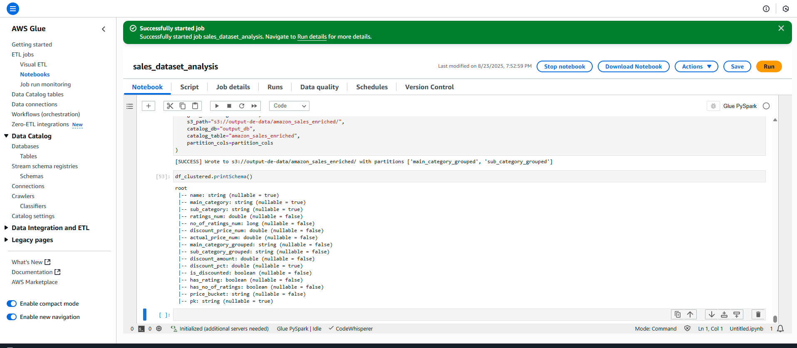
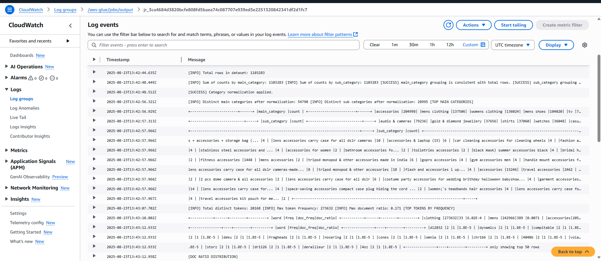
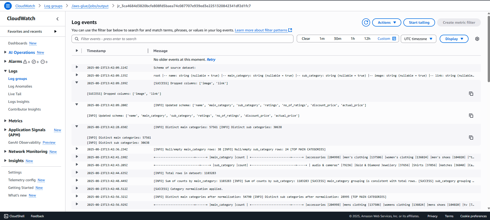
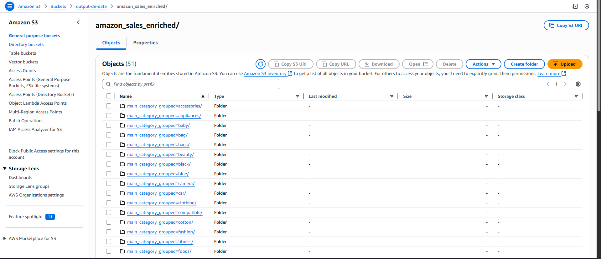
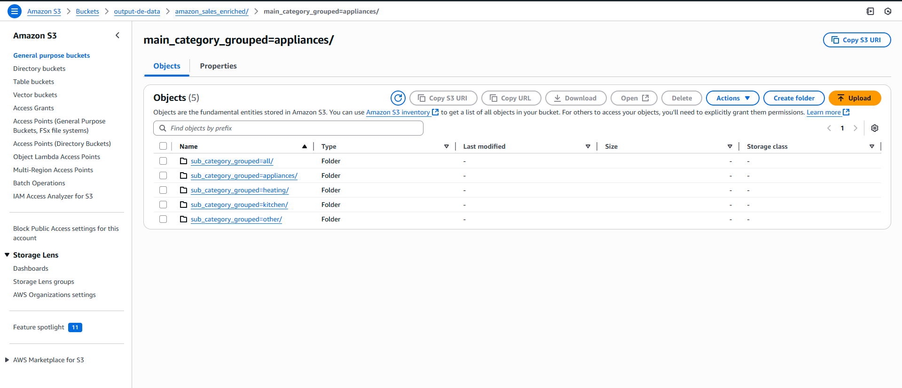
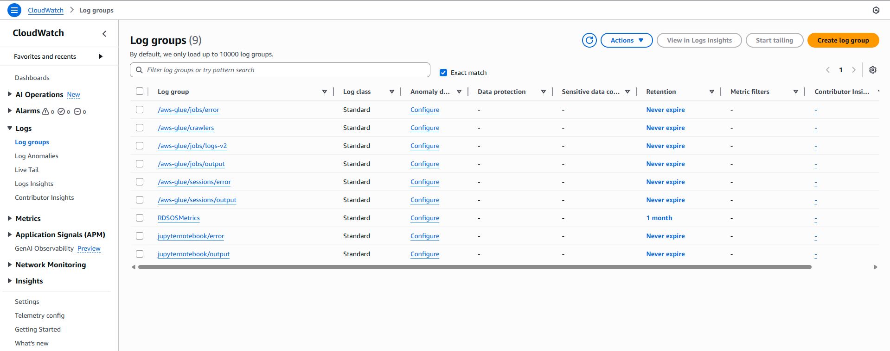
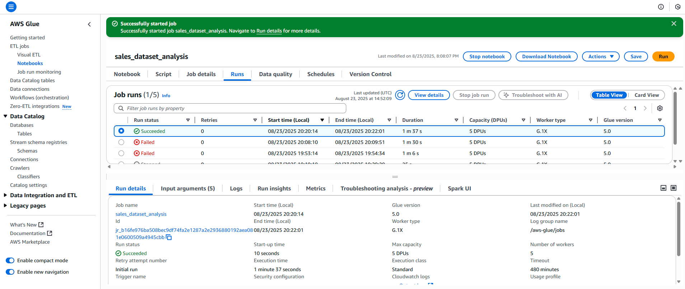

# Hands-On: Monitoring AWS Glue Jobs with CloudWatch

In this exercise, we run a Glue job from the notebook and track its execution using **CloudWatch Logs and Metrics**. Below are the steps and corresponding screenshots.

---

## Step 1: Start a Glue Job

From Glue Studio or the notebook, launch the ETL job. The job status changes to **Running**, and logs start streaming to CloudWatch.

---

## Step 2: Navigate to CloudWatch Logs

When a Glue job starts, it automatically streams its logs to a dedicated log group in **CloudWatch Logs**.

  

---

## Step 3: Observe Partitions and Processing

During execution, Spark tasks handle data transformations and write partitioned output into S3. You can verify partition creation and updates in CloudWatch logs and also check the S3 folder.

  

---

## Step 4: Review Execution Logs

Detailed logs show driver and executor activities, including transformations, shuffles, and output writes. You can search for `INFO`, `WARN`, or `ERROR` keywords to debug.

---

## Step 5: Verify Job Success

Once completed, the job writes a success marker and CloudWatch displays the final execution status. You can use this for setting up alerts and automated responses.

---

## Key Learnings
- Every Glue job creates a **log stream** in CloudWatch.  
- CloudWatch logs help **debug job failures** and monitor execution.  
- You can set up **CloudWatch Alarms** to notify on job errors or long runtimes.  
- S3 partitions created by the job can also be validated in logs and Athena.  

