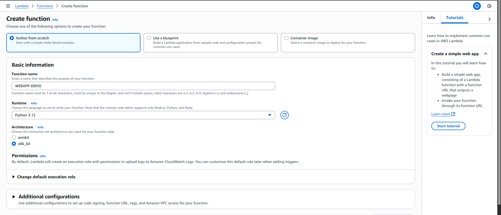
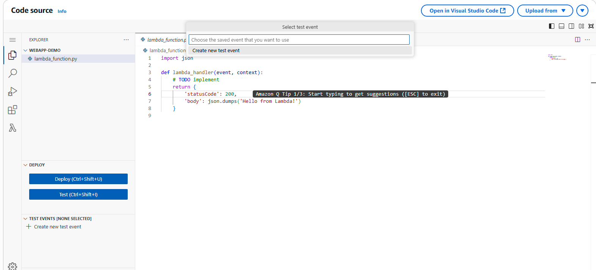
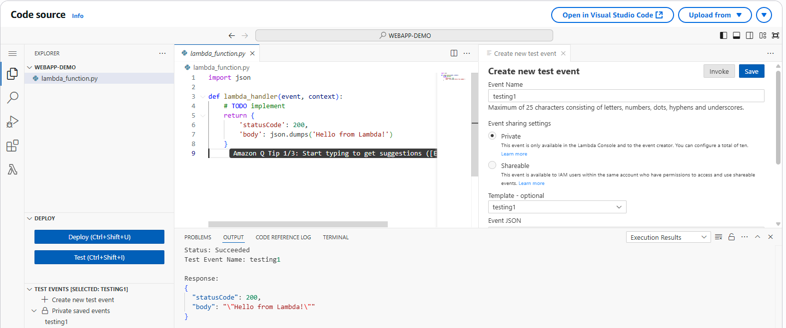
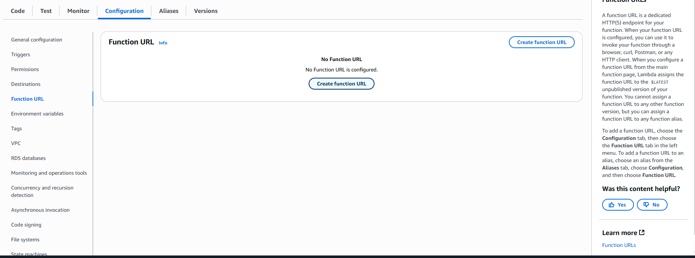
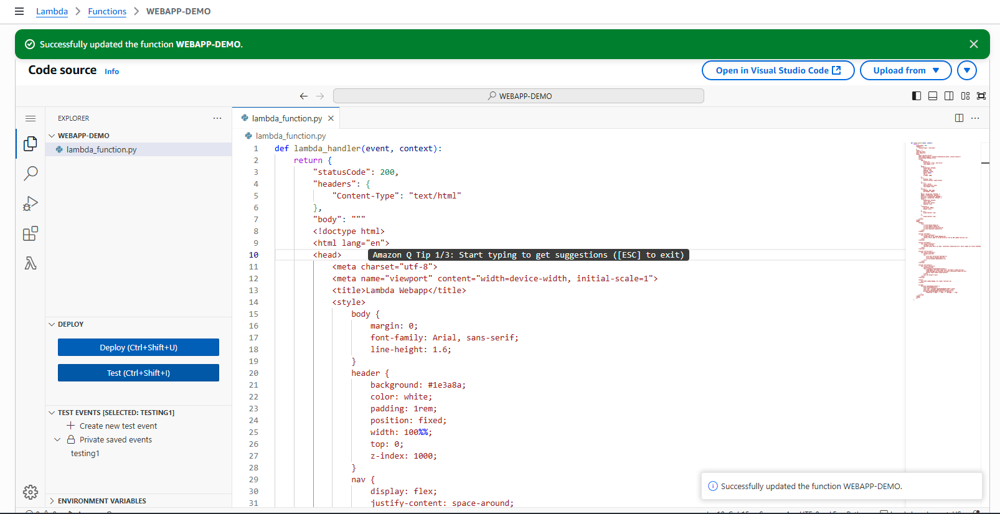
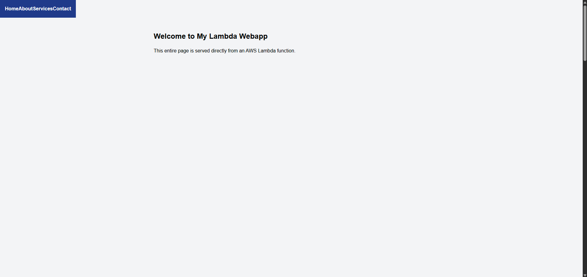
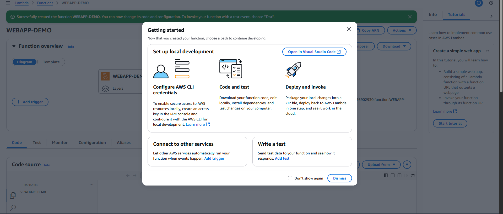
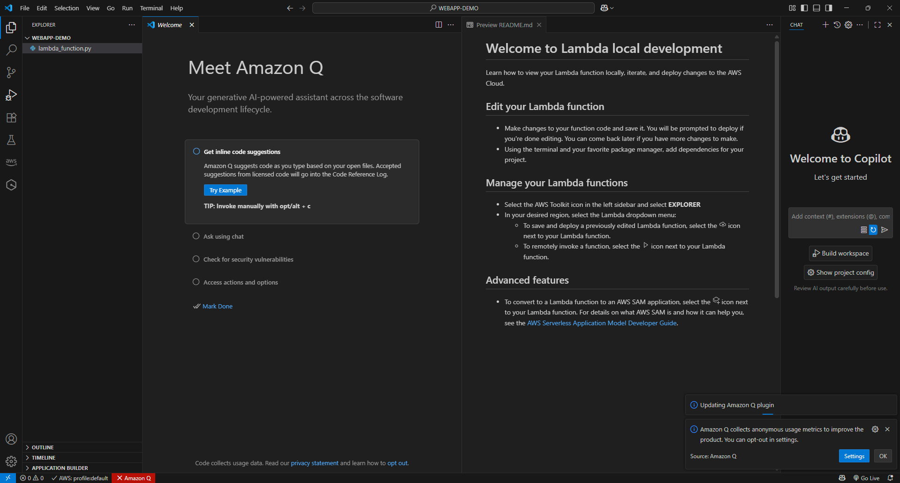

# AWS Lambda Hands-on: Hosting a Simple Web App

This walkthrough shows how to host a simple web app using **AWS Lambda Function URL**.

---

## 1. Create Lambda Function


- Go to AWS Console → Lambda → **Create function**
- Choose **Author from scratch**
- Runtime: **Python 3.12**
- Function name: `webapp-demo`
- Leave defaults, click **Create function**

---

## 2. Edit Function Code

- In the code editor, open `lambda_function.py`
- Replace the default code with:

```python
def lambda_handler(event, context):
    return {
        "statusCode": 200,
        "headers": {
            "Content-Type": "text/html"
        },
        "body": """
        <!doctype html>
        <html>
        <head><title>Lambda Webapp</title></head>
        <body>
            <h1>Hello from AWS Lambda!</h1>
            <p>This is a simple web app served directly from Lambda.</p>
        </body>
        </html>
        """
    }
```

- Click **Deploy**

---

## 3. Create Test Event
  


- In the **Test** tab, create a new test event (use default JSON)
- Run the test → You should see statusCode `200` with HTML output

---

## 4. Create Function URL


- Go to **Configuration → Function URL**
- Click **Create function URL**
- Auth type: **None**
- Invoke mode: **Buffered**
- (Optional) Enable **CORS** if you want to call from JS
- Click **Save**

---

## 5. Deploy Success


---

## 6. Open Hosted Page


- Copy the **Function URL** shown at the top of the function page
- Open in browser → You’ll see your hosted Lambda web page

---

## 7. Develop with Local VSCode

-- Code can also be developed in VS code and uploaded back and deployed




---

## Notes
- This method is best for **simple demo pages** or **micro frontends**
- For full static sites (HTML/CSS/JS folders), prefer **S3 + CloudFront**
- Lambda has a 6 MB response size limit for Function URL
- Always click **Deploy** after editing code

---
