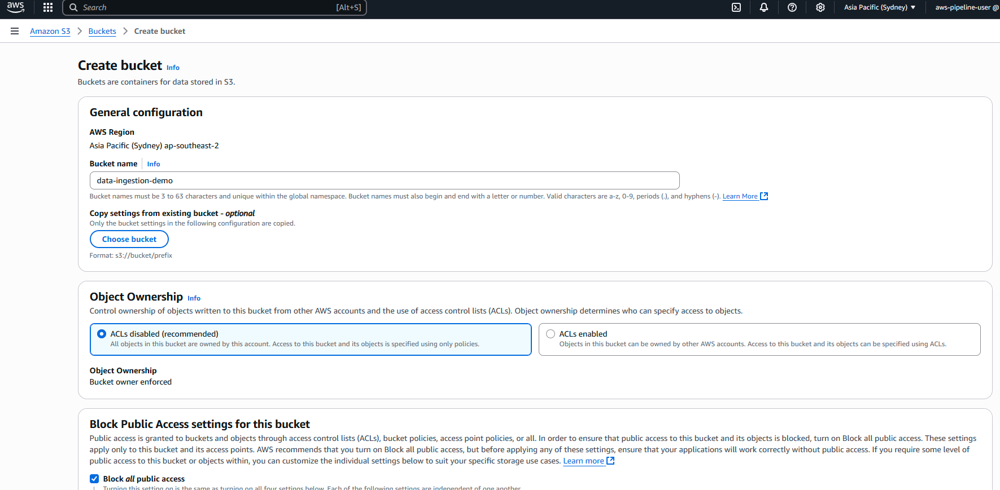
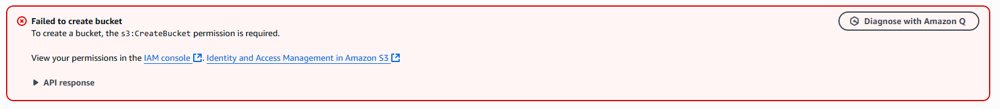
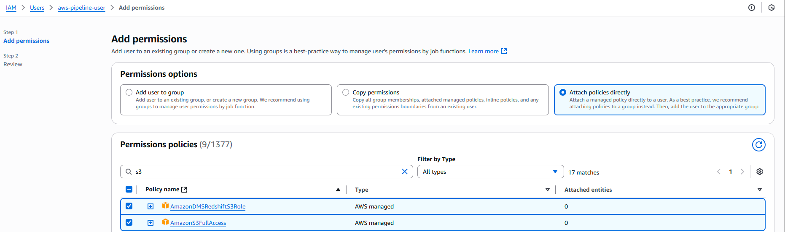
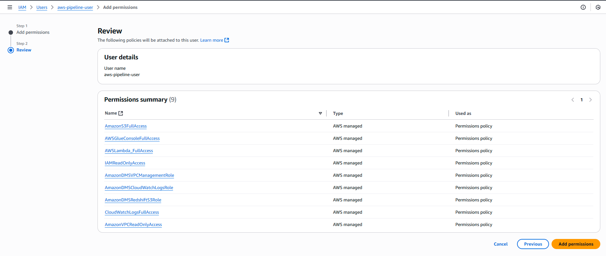
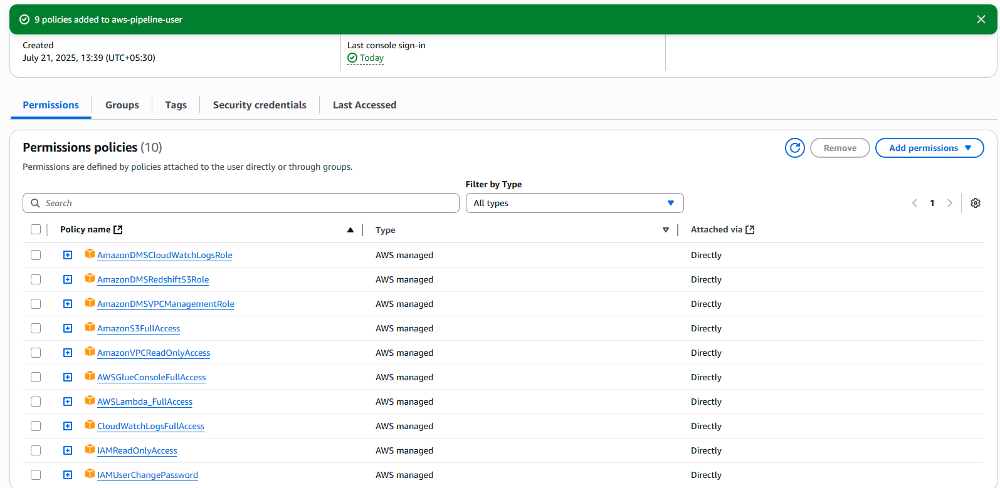
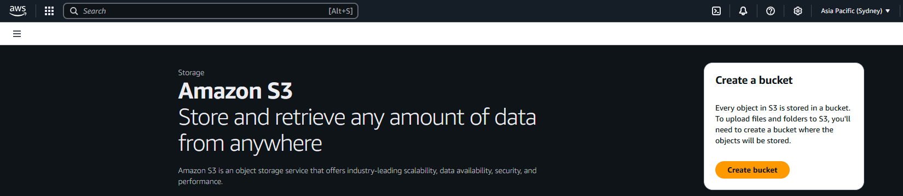
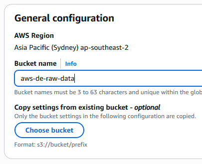
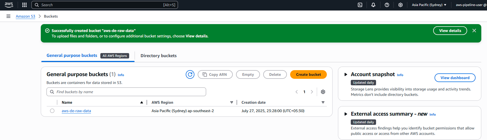
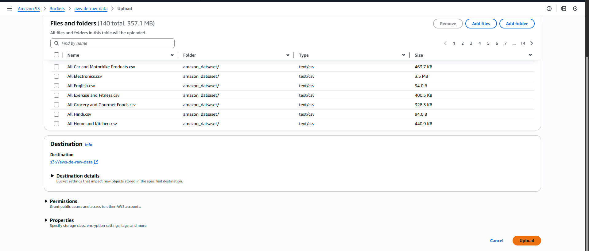
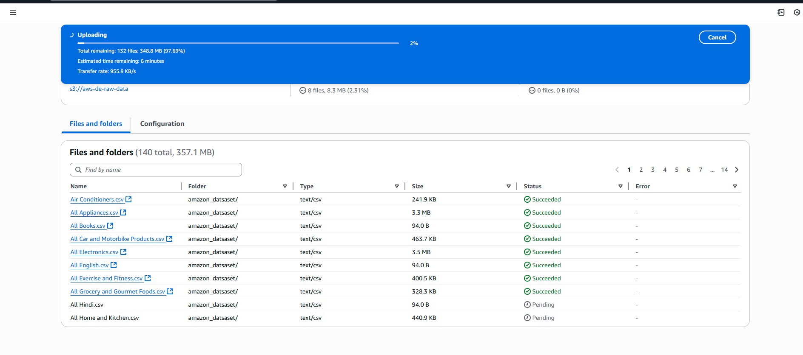

# IAM Setup and S3 Bucket Creation for AWS Data Pipelines

When you try to create a bucket in S3 without sufficient permission you will face below error

Follow the below steps to resolve it
## Part A: Attach Minimal IAM Permissions

### Step 1: Open IAM Console

* Navigate to the IAM Console.
* Go to **Users > your_iam_username > Permissions**.

### Step 2: Attach Required Policies

* Click **“Add permissions”** > **“Attach policies directly.”**

* Select the following **9 scoped policies**:

| Policy Name                   | Purpose                                                         |
| ----------------------------- | --------------------------------------------------------------- |
| `AmazonS3FullAccess`          | Full access to create and manage S3 buckets and objects         |
| `AWSGlueConsoleFullAccess`    | Full access to AWS Glue console for crawlers and jobs           |
| `AWSLambda_FullAccess`        | Full access to manage Lambda functions                          |
| `AmazonVPCReadOnlyAccess`     | Required for viewing VPC settings in services like Glue and DMS |
| `IAMReadOnlyAccess`           | Allows viewing IAM roles and permissions                        |
| `AmazonDMSVPCManagementRole`  | Required for setting up VPC configurations for DMS              |
| `AmazonDMSCloudWatchLogsRole` | Allows DMS to send logs to CloudWatch                           |
| `AmazonDMSRedshiftS3Role`     | Required when using S3 or Redshift as targets in DMS            |
| `CloudWatchLogsFullAccess`    | View and manage logs for Lambda, DMS, and Glue                  |

### Step 3: Review and Confirm

* Click **“Next”**, verify selected policies.
* Click **“Add permissions.”**

## Part B: Create S3 Bucket

### Step 1: Go to S3 Console

* Open the S3 Console.

### Step 2: Click “Create Bucket”

* Enter a **globally unique bucket name**, e.g., `aws-de-raw-data`.
* Select your desired AWS **Region**.

### Step 3: Configure Public Access

* Keep **“Block all public access”** enabled (recommended).

### Step 4: Skip Optional Settings

* Leave options like versioning and encryption as default for now.

### Step 5: Create the Bucket

* Click **“Create bucket.”**

> If you see `AccessDenied` errors, ensure that:
>
> * The `AmazonS3FullAccess` policy is attached.
> * No SCP or permission boundary is blocking access.

## Why These 9 Permissions Are Sufficient

* **S3, Glue, Lambda, and DMS** are the core services for Phase 2.
* **IAM and VPC read-only** ensures safe visibility without escalation.
* Keeps the principle of **least privilege** while enabling all required operations.

---

Next: Upload a CSV file to the new bucket, then trigger a Glue crawler to crawl and catalog it.

Uploading will start once you click on upload
