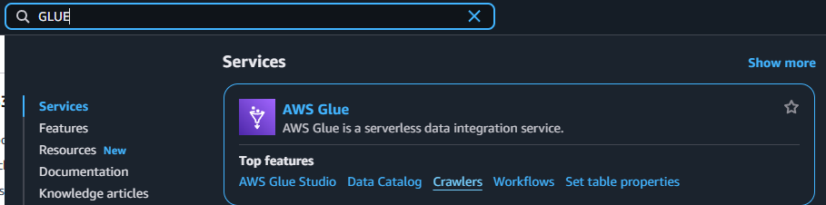
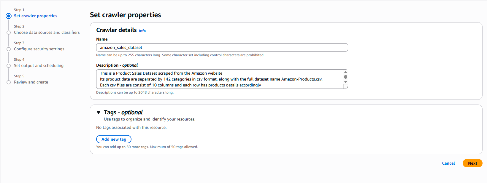
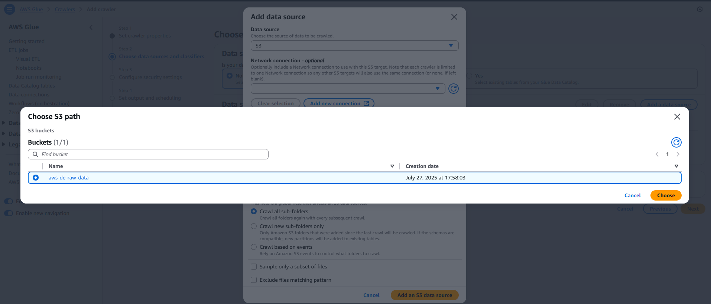
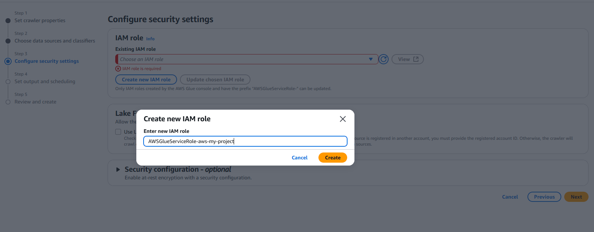

A crawler in AWS Glue scans your S3 files, detects schema, and creates tables in the Glue Data Catalog.

It's how Glue knows what data you have and how it's structured.

Steps:
## 1 Go to AWS Console → Glue → Crawlers

## 2 Click Create Crawler

## 3 Choose data store: S3, and select your bucket path.

## 4 et IAM role: Use existing or create a new one with Glue access.

* Choose:
"Create new IAM role" → then select "Glue" as the service that can assume the role.

* During setup:

Name it something like AWSGlueServiceRole-MyProject

Ensure it has permission to access your S3 bucket (you can manually add AmazonS3ReadOnlyAccess or custom S3 access later if needed)

Let Glue use this role to read your uploaded CSV files and write metadata to the Glue Data Catalog.

Set output: Choose a database or create one.

Run the crawler.